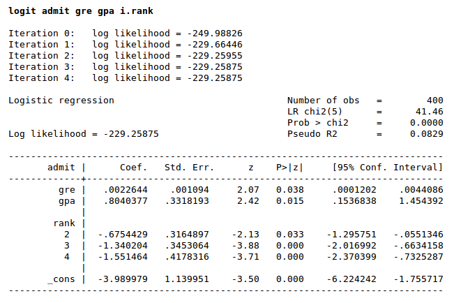

# Intro

*Logistic Regression* (logit model)

:   "is a regression model where the **dependent variable is categorical** and **binary**. Cases with **more than two** categories are called **multinomial logistic regression**. In other terms, it aims at predicting a binary response based on one or more predictor variables, making it a **probabilistic classification model**" ([Wikipedia](https://en.wikipedia.org/wiki/Logistic_regression))

It treats the dependent variable as the oucome of a Bernoulli trial rather than a continuous outcome (as it is done in the case of the traditional linear regression). By doing so, assumptions of traditional linear regression are violated (residuals won't be normally distributes, e.g.). Traditional linear regression also doesn't fit here as we predict probabilities - with lin reg we could get values below 0 or above 1, which wouldn't make sense for our model. Because of that we need to apply a transformation to the binary variable to transform it into a continuous (real, ranging from `-inf` to `+inf`) one so that we can use the tools we have to estimate the dependent variable. The mentioned transformation is the `logit` (or `log-odds`).

> "although the dependent variable in logistic regression is binomial, the logit is the continuous criterion upon which linear regression is conducted"

Another difference from the traditional linear regression is that the coefficients for this one are not calculated using the least squares approach, but using the maximum likelihood estimation (MLE)

## Probability and Odds

$$
Pr(something) = \frac{outcomesOFinterest}{allPOSSIBLEoutcomes}
$$

Knowing that $odds =  \frac{F(x+1)}{1-F(x+1)}$, i.e, odds equals to the probability of ocurring divided by the probability of not occurring, the odds ratio corresponds to:

$$
OR = \frac{odds(x+1)}{odds(x)}
$$

The **odds ratio** in logistic regression represents **how the odds change with a 1 unit increase in that variable holding all other variables constants**. The interesting thing of odds ration is that it lets us know the increase in the odds of something happening independently of where in the variable spectrum we are.

In `stata` it's called **R**elative **R**isk **R**atio.

> "The odds can have a large magnitude change even if the underlying probabilities are low"

## Linking Bernoulli to Linear Combination

The dependent variable in the logistic regression follows the bernoulli distribution having and unknonw probability `p`. As said before, in logistic regression we're estimating an unknown `p` for any given linear combination of the independent variables. Now, to link together independent and dependent variables we use the `logit` (natural log of the odds-ratio), which maps the linear combination of variables to the domain $[0,1]$.

$$
logit(p) = ln(\frac{p}{1-p}) , p \in [0,1]
$$

As $logit(p)$ gives us a sigmoid over the $y$ axis (while we want over the $x$ axis) we have to simply take its inverse:

$$
logit^{-1}(\alpha) =  \frac{e^{\alpha}}{1+e^{\alpha}} , \alpha \in \rm R$$

As $\alpha$ can be any number, there we can put our linear combination of variables and their corresponding coefficients estimated. The inverse-logit will then map that to the probability of being a $1$ or a $0$.

## Estimated Regression Equation

The logit is equivalente to the linear function of the independent variables. So, if we want to find the estimated probability we just have to perform some algebra:

From $logit(p) = ln(\frac{p}{1-p}) = \beta_0 + \beta_1x_1$:

$$
\hat{p} = \frac{e^{\beta_0 + \beta_1x_1}}{1+e^{\beta_0 + \beta_1x_1}}
$$

$$
Pr(y=0) = \frac{e^{0}}{e^{0} + e^{z_1} + ... + {e^{z_n}}
$$

$$
Pr(y=1) = \frac{e^{z_1}}{e^{0} + e^{z_1} + ... + {e^{z_n}}
$$

$$
Pr(y=1) = \frac{e^{z_2}}{e^{0} + e^{z_1} + ... + {e^{z_n}}
$$

## Interpreting the Output

- The $LR chi^2$ with $p-value < 0.05$ indicates that out model as a whole fits significantly better than a model without predictors.

- Analysing the confidence intervals of our coefficients we verify that none of them have the $0$ included and all have $P>|z| < 0.05$, indicating that all of them are statistically significant for our model.

## In Stata

- `glm <variables>, family(binomial) link(logit)`
- `logit <variables>`: reports coefficients
  - `stepwise, pr(0.05): logit <variables>`
- `logistic <variables>`: reports odds ratios
  - `stepwise, pr(0.05): logistic <variables>`

###

